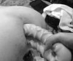
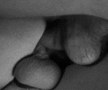
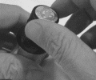

# 训练-晋级的方法和方式

[原文地址](http://unabatedspectrum.com/dfc/as_train.html)

## 准备好你的伴侣

**参考文献**
*   [伴侣间的信任和亲密关系](http://unabatedspectrum.com/dfc/as_coach.html)
*   [身体语言](http://unabatedspectrum.com/dfc/as_body.html)
*   [拳交有关的解剖知识](http://unabatedspectrum.com/dfc/as_anatomy.html)
*   [升级路线](http://unabatedspectrum.com/dfc/as_depth.html)

### 如何选择伴侣

在拳交的深入训练和尺寸扩张训练过程中，最好能够有一个有经验的助手。这个助手不但要能够非常理解拳交的各种知识，还要对被训练者有非常深入的了解。他要有能力通过你的身体语言了解精神和身体状况。被训练者需要需要能够非常信任这个助手。

### Roadmaps and Communication

对于拳受来说，了解肛道的构造和结构对于拳交大业是非常有意义的。一种理想的升级路线如下：

*   开始方式和体位 Starting points and positions
*   长度及持续时间 Lengths and durations
*   路标 Route markers
*   障碍和风险 Obstacles and hazards

*   Fisting Roadmaps
*   (of Finn Vortex)
*   [Depth Insertions](file:///C:/Users/Colter/Documents/Websites/spectrum/dfc/documents/roadmap_depth_fisting_1.pdf)
*   [Girth Insertions](file:///C:/Users/Colter/Documents/Websites/spectrum/dfc/documents/roadmap_girth_fisting_1.pdf)

为了增进你和伴侣之间的关系，你们都应当了解更多关于你（受）的身体和肛道结构方面的知识。你们还可以开发新的顺序，信号以及模式。 如果你的伴侣不能跟上你的进度，还不能在精神上立即或者积极沟通的话，你可能要考虑换一个训练的伴侣。

## 自我准备

**参考文献**
*   [扩张练习](http://unabatedspectrum.com/dfc/as_stretch.html)
*   [清理/灌肠](http://unabatedspectrum.com/dfc/as_wash.html)
*   [润滑剂](http://unabatedspectrum.com/dfc/as_lubrication.html)
*   [训练场所](http://unabatedspectrum.com/dfc/as_play.html)
*   [玩具/工具](http://unabatedspectrum.com/dfc/as_toys.html)

### Fist Chute

在开始针对骨灰级拳交行为（快拳，双拳及深拳）训练之前，需要先做些准备工作。 确保已经做到适度的灌肠，润滑和预扩张等。如果这些准备工作做得太过也可能影响训练。

### 环境和装备

对训练场所的熟悉程度很容易影响你和伴侣的心情，从而在很大程度上影响你的训练成果。不熟悉的或者脏乱的环境可能使受很难放松。

同样的道理，选择了适当的工具会是你的训练事半功倍。

# 方向和练习

在尝试冲刺下一个阶段的目标之前，根据你目前的技术水平和扩张程度设定训练的频度和每次训练的时间。

例如：如果你已经达到了很容易进入单拳的水平（比如，如果肛道能够在开始练习的情况下三分钟能吞入一个中等大小的单拳），就应该每周都练习以便晋级到更大的深度。

要增加深度，可以尝试以下的升级路线

## 深拳路线

###  熟练适应玩具的双插
*类别：自行练习*

#### 工具及设备

* 一个小号假阳具（小于17x4厘米）One small, realistic dildo (less than 6.5 X 5)
* 一个较大的假阳具（至少是20x5厘米），最好有较大的底座
* 可以用于玩具的润滑剂Toy compatible lube

#### 目标

* 训练肛道对于扩张的身体记忆及对于压力的容忍度
* 适应粗大物体的插入（自行插入）

**时间和要求**
* 时间：三到六个月
* 训练用时：不少于半小时
* 频度：至少每周一次
* 灌肠清理：第一级

[PDF版指南](http://unabatedspectrum.com/dfc/documents/training_mastering_dp_with_toys.pdf)

[视频演示](http://unabatedspectrum.com/dfc/video/dp_with_toys.mpg)

#### 方法步骤

1. 使用小尺寸的仿真阳具和大尺寸的开发菊花:

* 首先使用较小的仿真阳具重复出入动作几分钟时间
* 使用较大的阳具重复上面的步骤直到适应为止

2. 开发肛道内部和直肠:

* 重新使用较小的仿真阳具，用更大的幅度和不同角度进行不规则的旋转及出入动作
* 用同样的方法练习较大的阳具.

3. 开发肛穴和括约肌:

* 首先使用较大的阳具，插入时在旁边同时插入一个手指。一般来说比较容易进入的位置在菊穴的下方，或者说靠近蛋蛋的方向
* 让手指围绕阳具旋转，完成整个360度的一周.
* 重复旋转并增加更多手指，直到能够和较大的阳具同时插入两到三个手指而无不适感.

7. 扩大菊洞和环状肌肉:

* 首先把较大的阳具插入到根部（淡淡的深度）
* 重新润滑菊穴
* 在较大的阳具上方（远离蛋蛋的方向）插入较小的阳具
* 尽可能长时间保持插入状态
* 重复以上练习，然后开始出出入入的操作

#### 调养

开始阶段，再次训练前需要休养至少一周时间。即使很好的使用了润滑剂，在菊洞插入越来越大的工具时，都会有细微的撕裂。
即使在练习前灌肠了，在过程中也可能会感觉到需要排泄。因为你的身体发生了反射性的肠蠕动。

 autonomic peristalis: the wormlike movement by which tubular organs with both longitudinal and circular muscle fibers propel their contents, consisting of a wave of contraction passing along the tube. 

在马桶上坐几分钟或冲澡可以使直肠停止向大脑报告这种神经冲动

#### 提示

* 记得一定要使用足量的润滑剂
* 副交感神经
副交感神经用于调节身体无意识的行为，例如性冲动，消化和排便。 对于直肠而言，副交感神经会在内部压力达到18托（毫米汞柱）时触发，并且向大脑发送排便的信号。当压力达到55托时，副交感神经会使直肠自动排空（拉裤子里）。

	nerves responsible for regulating the body's unconscious actions, such as sexual arousal, digestion, or defecation
	in the rectum, these nerves are initially triggered at 18 torrs (mm Hg) of pressure—which sends a defecation impulse to the brain
	at 55 torrs, the contents of the rectum are expelled automatically (you shit your pants) trigger your brain to contract and relax the rectum and anus. Conducting the DP procedure alone allows you to increase the dimensions of your chute as well as the pressure point before your body triggers peristalsis.

#### 进阶

当习惯以后，无论何时有机会的话，都应该尝试以上的训练直到可以插入两个阳具

### 熟练接受男人的双插（双龙入洞）

*类别: 在他人协助下的练习*

#### 工具箱

* 20厘米尺寸的大号攻（更大也可以），正常粗度， 数量一枚
* 13厘米的小号攻（更大也可），正常粗细， 数量一枚
* 大量润滑剂，最好是硅基或者混合的类型

#### 目标

* 训练肛道对于扩张的身体记忆及对于压力的容忍度
* 适应不可控制的粗大物体的插入

#### 时间和要求

* 时间：可以跟用工具双插的训练同期进行
* 训练时间：大约一小时
* 频度：无论何时有可能的话
* 灌肠，清理：第一级
* 精通：工具双插

[PDF版](http://unabatedspectrum.com/dfc/documents/training_mastering_dp_with_boys_(men).pdf)
[演示视频](video/dp_with_boys(men).mpg)

### 方法步骤

1. 受首先分别为每个攻服务五到十分钟
2. 把攻摆在攻击的位置
* 让大攻坐在床边上
* 让他向后倒，摆成平躺的位置，这是他的脚仍然垂在地上。确保膝盖的背面靠在床上

*   让小号攻站在旁边等受做好双插的准备工作
3.  受用面对面的姿势上大号攻
    

* 让他的阳具连根进入（坐到蛋蛋的深度），保持这个深度

* 向前倾到接近胸部相互靠近的姿势，以便另外一个攻进入攻击位置

4. 让另一个攻插入.

  

* 让小号攻准备开始插入过程。一般来说，最容易进入的位置在菊穴的最远端（离蛋蛋最远的位置）.
* 让小号攻继续插入直到两个阳具都连根进入.

5. 只要受还想要，使用各种不同的力度继续干吧，也可以各种调整姿势.

#### 事后调养

和用工具双插一样，在尽性玩过后需要至少一周时间才能再玩。过于激动的攻们在这么刺激的环境下，会给菊穴带来相当多的微小撕裂，尤其是受无法控制抽插进度的时候。

#### 提示

* 可能的尴尬情况
  1. 不是所有的攻都能做得到双插的姿势
  2. 在某些姿势下，大号攻可能没法抽动
  3. 对双插没太多经验的新人可能会秒射

* 三人行的话，如果有受乐意或者能接受，大部分攻都应该会愿意玩双龙的。一般情况下，应该由受来提出双龙的建议并且控制插入的节奏。

#### 掌控/进阶

当扩张到更大尺寸，能够更容易接受的情况下，可以在双龙过程中尝试各种不同的姿势

### 接受单拳

*类型：需要伴侣的训练*

#### 工具箱

*  小手拳攻一枚
*  小号的假阳具和大号的假阳具
*  纸巾
*   Room Odorisers/Poppers
*   Towels or pads to place beneath the Bottom
*   Copious amounts of lube, preferably specialty or hybrid variety
*   Table salt (if using J-lube)

** 目标**

* 对于扩张肛门和肛道的身体记忆，特别是直肠
* 承受手或者拳头的插入
* 能够容忍手或拳头在直肠内移动
* 适应攻/受之间的拳交关系

**时间**
任务周期： 三到六个月
任务时间：至少15到30分钟
频率：半月一次
灌肠/清洗：第一级

*   [PDF打印版](http://unabatedspectrum.com/dfc/documents/training_mastering_a_single_fist.pdf)
*   [视频演示](http://unabatedspectrum.com/dfc/video/single_fist.mpg)

#### 步骤/方法

1.  Communicate limits and expectations and prepare the environment:

*   Determine in advance the ground rules and limits of each party. Allow an experienced Top some discretion and the virgin Bottom a challenge to persevere.

Chris Ward has authored an excellent article about [introducing catchers to the handball pitch](documents/advice_introducing_catchers_to_the_handball_pitch.pdf).

* Prepare mentally for physiological sensations, specifically noting that just before the ring-pop, the stretch may seem unbearable—it may be easier to continue forward as compared to reversing backward.
* Discuss the entrance and exit strategies such as duration inside (about 30 seconds) with very limited movement by the Top, retraction process (100% easier and less pain), entrance routine (steps three and four).
* Break the seal on the poppers.

2. Determine the most comfortable entrance position:

* Natural Squat. This position allows the Bottom to control entrance by sitting on the hand of the partner. It also aligns the body in a position where the hole will open up most easily.
* Back or Left Side. This position allows the Top to easily massage the hole while reading the face and [body language](a_body.html) of the Bottom.
* Doggie. This position provides full control to the Top, but allows the Bottom to squat on the hand if necessary.

3. Stretch/loosen the hole with less than fifteen minutes of basic ass play:

*   Start with toys or cock at full depth penetration.

* Apply the specialty lube to the hole and hand of the the Top.
* Introduce fingers one at a time until four fingers are easily accepted.

4. Proceed to fist insertion:

* Continue with four finger ass play, gradually going full-knuckle-four-wide.
* Focus on deep breaths and meditative thoughts.
* Inhale poppers and push out while the Top applies continual pressure to the hole.
* Establish eye contact, relax (stop pushing), and release control to the Top to allow post-knuckle insertion.
* After passing the ring, breath deep and resist the urge to push out.

#### Aftercare

If it was your first fist, you should wait a couple of weeks before trying again to allow your body to recover. Even as an established fister, I am exhausted after a session that has pushed my limits.

As with DP and toys, your body may still be receiving signals to expel what is inside the rectum (even if there isn't anything in it). A cool shower can help reduce those signals.

Although not necessary, you may want to douche post play to remove excess lube, especially if it is J-lube. When you shower, having table salt available to remove lube on your skin is also helpful.

#### Tips

* The Bottom will immediately feel the urge to expel the wrist, as the rectal pressure exceeds 55 torrs. Resist this impulse, as the Top will not be able to re-enter during this session.
* Taking your first fist is a mental exercise. If you completed activities that have previously stretched your hole and followed the massage routines here, there will be little or no tearing of the anal tissues.

#### Mastery/Progression

Further progression will now require significantly larger dildos.

### Mastering the Second Ring
*Category: Partnership Exercises*
    
**Supply Warehouse**

* Small hand Top - QTY: 1
* Extra-large dildos
* Paper towels
* Room Odorisers/Poppers
* Towels or pads to place beneath the Bottom
* Copious amounts of specialty lube
* Mister for lube rehydration
* Table salt (if using J-lube)

**Goals**

* Passage into the sigmoid colon
* Expanded memory of second ring and fist chute, specifically the sigmoid
* Establishment of comfortable resting zone at mid forearm

* Duration & Pre-requisites
* Period: Six Months to One Year
* Session Duration: ~1 Hour
* Frequency:  
Solo - Semi-weekly  
Partnership - Weekly  
        
* Douche: [Level 2](as_wash.html#L2)
* Mastery: Single Fist
    
* [Print these instructions](documents/training_mastering_the_second_ring.pdf)
* [View the demonstration](video/second_ring.mpg)
    
#### Steps / Procedure

1. Stretch the ring with [girth](as_train.html#progression) toys:

* Start with a 9 X 5 inch toy_**Minimum Size: 9 X 5**_  
most manufacturers create toys in this range; the Doc Johnson _Ballsy Supercock_ series maxes out at nine inches at full depth.

* Continue a gradual increase in size to full depth at 12 inches_**Minimum Size: 12 X 5**_  
most manufacturers create double-ended toys of this size; the Doc Johnson _Double Headed_ and _Double Headed JR_ max out at eighteen and twelve inches respectively  
        
the smaller colon snakes from Fort Troff are also suitable.
* Finish by piston-fucking the hole with the longer dildo until comfortable with the girth.
    
2. Expand [girth](as_train.html#progression) and increase duration and stamina:

*   Start with 9 X 6.5 inch toys at full depth.
*   Continue a gradual increase in size to full depth at 10 X 7.5 inches_**Minimum Size: 10 X 7.5**_  
the best toy for this exercise is Doc Johnson's _John Holmes U3_ dildo.
*   Remain balls deep for one, three, and five minute intervals on the 10 X 7.5 toy.

3.  Pop the second ring:

*   Start third knuckle-deep with four fingers in duck-billed position.
*   Flatten the duck-bill over several sessions.
*   Return to duck-bill position and introduce thumb.
*   Finish by increasing pressure until through ring.

4.  Develop a resting place with duration and stamina exercises for one, three, and five minute intervals.

#### Aftercare

As with your first fist, you should wait a couple of weeks before trying again to allow your body to recover.

If there was significant pinkness, montitor your bowel movements for blood. At this depth, if you are in pain, always seek medical care immediately and be honest about how you acquired your injury. Waiting a few hours may cost you your life.

#### Tips

*   As with any new milestone, there will be blood. Monitor the lube 'pinkness factor' in every session. Tops should always notify the Bottom whenever they see pink so that the Bottom can determine if the session can continue.
*   Go slowly and at the pace of the Bottom!

#### Mastery/Progression

Continued practice at this depth helps create a rest area for the next major hurdles: the pelvic opening and S curve.

### Girth - Toy Reference Chart (Starter Grade)

| Toy | Grith | Length | Manufacture |
|----|----|----|----|
|Ballsy Super Cock | 4.87 | 8.31 | Doc Johnson|
|    Double Header JR | 4.87 | 12| Doc Johnson|

    Toy
    
    Girth
    
    Length
    
    Manufacturer
    
    [Ballsy Super Cock](javascript:HideAllShowOne('ballsy_super'))
    
    4.87
    
    8.31
    
    Doc Johnson
    
    [Double Header JR](javascript:HideAllShowOne('double12'))
    
    4.87
    
    12
    
    Doc Johnson
    
    [Double Header Dong](javascript:HideAllShowOne('double18'))
    
    4.87
    
    18
    
    Doc Johnson
    
    [Kevin Dean](javascript:HideAllShowOne('dean'))
    
    6.91
    
    10
    
    Doc Johnson
    
    [John Holmes](javascript:HideAllShowOne('holmes'))
    
    7.54
    
    9.90
    
    Doc Johnson
    
    For _Advanced/Professional Grade_ toys, visit [Art & Science: Lord of the Rings](as_lord.html#expansion) or [Art & Science: Toys](as_toys.html)
    
    
    
    
    
    
    
    
    
    
    
    

    
### Mastering Elbow Depth Insertion
*Category: Partnership Exercises*

**Supply Warehouse**

* Small hand Top - QTY: 1
* Extra-large dildos
* Paper towels
* Room Odorisers/Poppers
* Towels or pads to place beneath the Bottom
* Copious amounts of lube
* Mister for lube rehydration
* Table salt (if using J-lube)

*   Goals
*   Passage up to the third ring
*   Expanded memory fist chute, specifically the iliac & descending colons
*   Development of internal road map

*   Duration & Pre-requisites
*   Period: Six Months to One Year
*   Session Duration: ~1 Hour
*   Frequency:  
  Solo - Semi-weekly  
  Parntership - Weekly  

*   Douche: [Level 3](as_wash.html#L2)
*   Mastery: Second Ring

*   [View the demonstration](video/elbow_depth.mpg)
*   [Print these instructions](documents/training_mastering_elbow_depth_insertion.pdf)

#### Steps / Procedure

1.  Straighten the sigmoid, iliac, and S curve with [length and girth](as_train.html#progression2) toys:

*   Start with a 18 X 5 inch _**Minimum Size: 18 X 5**_  
most manufacturers double-headed toys of this size; the Doc Johnson _Double Header_ can be smooth or veined colon snake or soft double-header at fourteen inches.
*   Shift gradually to firmer toys _**Minimum Size: 18 X 6.75**_  
the _Dick Rambone_ from Doc Johnson is probably the best choice form firmness and girth with increased girth.
*   Finish by slow piston-fucking at full depth until comfortable with the depth and girth; usually a balls deep insertion takes 10 to 15 seconds.

2.  Begin coaching sessions with a knowledgeable Top in order to map out the road map:

*   Start by experimenting with the best hand positions for passing through the pelvic opening, through the S, and past the bladder.
*   Locate or develop resting positions for recovery without full withdrawal.
*   Consciously monitor breathing, body signals, and pressure points.

3.  Increase depth at a snail's pace:

*   Push through the pelvic floor, iliac, S curve to the next resting place.
*   Inhale poppers before continuing.
*   Brace for depth insertion (Bottom bears down while Top pushes in).
*   Push to last ring.

#### Aftercare

You will likely experience body orgasms at this depth. Breath deeply to calm your body down.

Follow the road map you used to get elbow deep in reverse to exit the fist chute. The Bottom will determine the speed for extraction.

#### Tips

* Squatting and sitting back on your dildos is the best position for straightening the fist chute.
* Slow piston fucking at resting points increases the length of that rest area.
* Pulling out and reinserting allows the intestine to slip over the hand like a turtle-neck. The first pass applies lube and the second pass glides past any previous snags.

#### Mastery/Progression

Seek advice from pit fisters for additional depth.

### Length & Girth - Toy Reference Chart (Starter Grade)

    Toy
    
    Girth
    
    Length
    
    Manufacturer
    
    [Hung](javascript:HideAllShowOne('hung'))
    
    8.48
    
    9.75
    
    Doc Johnson
    
    [Dick Rambone](javascript:HideAllShowOne('rambone'))
    
    7.5
    
    14.5
    
    Doc Johnson
    
    [Exxxcess](javascript:HideAllShowOne('rascal'))
    
    8.64
    
    15
    
    Rascal
    
    [Colossus](javascript:HideAllShowOne('colossus'))
    
    9
    
    14
    
    XR Brands
    
    [Atom Bomb](javascript:HideAllShowOne('american'))
    
    9
    
    10.8
    
    Doc Johnson
    
    For _Advanced/Professional Grade_ toys, visit [Art & Science: Lord of the Rings](as_lord.html#expansion) or [Art & Science: Toys](as_toys.html)
    
    
    
    
    
    
    
    
    
    
    
    
    
    
### Advice and Tips from the Pros
*Category: Solo & Partnership Exercises*

* [Introducing Catchers to the Handball Pitch](file:///C:/Users/Colter/Documents/Websites/spectrum/dfc/documents/advice_introducing_catchers_to_the_handball_pitch.pdf)

### Girth Routines

Additional content for girth routines is currently in development. Want to [contribute](m_resources.html#content)?

Tracking Progress
-----------------

### Maintaining a Journal

Additional content for this section is currently in development. Want to [contribute](m_resources.html#content)?

For additional information on tracking personal progress, review the following article: [Art & Science: Strecthing — Case Study: Stretching with Special Agent](as_stretching.html#study)

### Capturing Video

Additional content for this section is currently in development. Want to [contribute](m_resources.html#content)?

Case Study: Elbow-Depth Stamina Training
----------------------------------------

### Reference Point

This case study follows Finn Vortex's attempt to increase play time during elbow-depth sessions. It replicates at a higher scale the activities beginners need to follow to start depth fisting.

### Journal/Blog

#### 01 October 2017

After a two weeks of depth fisting and an intense weekend play session, I have determined that I would like to increase my stamina when guys are going deep. Most notably, I find myself worried about authorizing somebody to stay that long inside my hole that doesn't have my complete trust.

#### 02 October 2017

I successfully reached the elbow line on a medium size guy (normal arms and hands). His arm was fairly contorted, and I did most of the driving. He was SUB, a point that was clarified during the session. This still has to do with my injury concerns and the play styles of those I'm not completely familiar with.

#### 03 October 2017

Having received the nine-minute training video from Poppersgod ([Art & Science: Poppers — Training](as_poppers.html#train)), I have commenced on a daily routine with the first milestone/goal of consuming [Boss Hogg](http://unabated-toybox.tumblr.com/post/166113953494/temp-place-holder-boss-hogg), from Mr. Hankeys Toys, to the base. I'm currently 2.5 inches from that goal. While I am able to use [Can Opener](http://unabated-toybox.tumblr.com/post/166113979979/temp-place-holder-can-opener) as the starter toy, its shape is different for second ring penetration, as compared to Hogg. At least two weeks of sessions will be needed.

#### 04 October 2017

Daily Session - 20 Minutes | No visible progress.

#### 05 October 2017

Daily Session - 20 Minutes | Able to take [SquarePeg Splitter](http://unabated-toybox.tumblr.com/post/166113969829/temp-place-holder-splitter) (thirteen inch maleable circumference) after a five minue wrestle.

#### 06 October 2017

Daily Session - 20 Minutes | No visible progress.

References / See Also
---------------------

The following source materials provided content (direct quotes or research data) for this page:

*   None

Update History
--------------

These updates have been made to this page:

*   06/24/2017: Removed toy section and added sections on preparation and logging, including quick reference links and _Finn Vortex Insights: Roadmaps_
*   06/21/2017: Applied new style sheets
*   05/15/2016: Reformatted and added toy section
*   03/15/2016: Published

Planned enhancements for this page include the following items:

*   Information on logging training activities for further progression analysis
*   Girth fisting exercises
*   Pit-depth fisting exercises
*   Video demonstrations of fisting routines

© Fist Club | 2016 ☷☷ [Help Wanted](m_resources.html#content) ☷☷ [Content Violations?](m_resources.html#legal)
