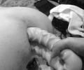
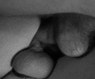
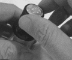

Preparations For Extreme Fisting
--------------------------------

[Origian link](http://unabatedspectrum.com/dfc/as_train.html)

### Preparing Your Partners

*   QUICK REFERENCE
*   [Trust and Relationships](as_coach.html)
*   [Body Language](as_body.html)
*   [Fisting Anatomy](as_anatomy.html)
*   [Roadmaps](as_depth.html)

#### Partner Selection

You will need to find a skilled partner 
for many of your depth or girth fisting routines. 
This individual should be somebody who understands 
not only the basics of fisting, 
but also understands you. 
He should be able to always assess your mental 
and physical state by understanding your body language. 
You should also be able to trust your partner 
with your life.

#### Roadmaps and Communication

It is helpful as a Bottom to document the anatomy of your fist chute to assist others in your fisting expeditions. A good road map includes the following:

*   Starting points and positions
*   Lengths and durations
*   Route markers
*   Obstacles and hazards

*   Fisting Roadmaps
*   (of Finn Vortex)
*   [Depth Insertions](file:///C:/Users/Colter/Documents/Websites/spectrum/dfc/documents/roadmap_depth_fisting_1.pdf)
*   [Girth Insertions](file:///C:/Users/Colter/Documents/Websites/spectrum/dfc/documents/roadmap_girth_fisting_1.pdf)

As you develop your relationship with your partner, 
both of you will likely learn more about yourselves 
and your fist chute anatomy. You will also develop 
special queues, signals, and patterns for your routines. 
If your partner cannot follow your roadmap, 
nor communicate or engage mentally at the 
highest levels with you, 
then you should select a different training partner.

engage:吸引住(注意力、兴趣);雇用;聘用;与…建立密切关系;尽力理解

mentally:精神上;智力上;思想上

### Preparing Yourself

*   QUICK REFERENCE
*   [Stretching](as_stretch.html)
*   [Wash and Go](as_wash.html)
*   [Lubrication](as_lubrication.html)
*   [Play Rooms](as_play.html)
*   [Toys](as_toys.html)

#### Fist Chute

You'll need make specific preparations prior 
to starting your training routines for any type of extreme fisting 
(punching, double, or post-elbow insertion). 
Make sure you douche, lube, and stretch appropriately. 
Under or over doing any of those activities can 
result in a reduced training session.

prior
adj.
先前的;较早的;在前的;优先的;占先的;较重要的;在前面的
n.
(小隐修院)院长;(隐修院)会长，副院长

#### Environment & Play Equipment

Familiarity with your play space can help improve 
your training outcomes by setting both you 
and your partner's moods at ease. 
Unknown or messy enviroments can affect your ability to relax.

mood: 情绪，心情

messy: 脏乱差

In a similar vein, 
selecting the appropriate toys to reach your goals 
is essential continuing progress and reaching new milestones.

Routines and Exercises
----------------------

Set established frequencies and durations for training based on 
your current skill level and strech capacities before moving to 
the next mastery level.

For example, if you have already mastered a single fist 
with ease (specifically, if your fist chute can swallow 
a medium fist in less than three minutes of beginning a 
session), then you will need weekly play to advance to 
any substantial depth.

chute
英 [ʃuːt]  美 [ʃuːt]  
n.
(人或物可顺势滑下的)斜槽，溜道

swallow
英 [ˈswɒləʊ]   美 [ˈswɑːloʊ]  
v.
吞下;咽下;(由于紧张等)做吞咽动作;吞没;淹没;侵吞
n.
燕;咽;吞;一次吞咽的量;一口

substantial
英 [səbˈstænʃl]   美 [səbˈstænʃl]  
adj.
大量的;价值巨大的;重大的;大而坚固的;结实的;牢固的

The following routines walk you through increasing depths:

### Depth Routines

1.  ###### Category: Solo Exercises
    
    Mastering DP with Toys
    ----------------------
    
    *   Supply Warehouse
    *   One small, realistic dildo (less than 6.5 X 5)
    *   One large, realistic dildo (minimum 8 X 6.5) with suction base if possible
    *   Toy compatible lube
    
    *   Goals
    *   Expanded stretch memory of anus and pressure tolerance of fist chute
    *   Comfort with girth insertions (by self)
    
    *   Duration & Pre-requisites
    *   Period: Three to Six Months
    *   Session Duration: 1/2 Hour Minimum
    *   Frequency: Once Weekly Minimum
    *   Douche: [Level 1](as_wash.html#L1)
    
    *   [Print these instructions](http://unabatedspectrum.com/dfc/documents/training_mastering_dp_with_toys.pdf)
    *   [View the demonstration](http://unabatedspectrum.com/dfc/video/dp_with_toys.mpg)
    
    ### Steps / Procedure
    
    1.  Open up the hole using the small and large dildos:
    
    
    
    *   Start with the small dildo using repeated in-and-out motions for several minutes.
    *   Repeat with the larger dildo for the same duration until easily accommodated.
    
    3.  Stretch the inner anal canal and rectum:
    
    *   Return to the smaller dildo but use a broad series of motions and angles that are atypical of the in-and-out gyrations of standard fucking.
    *   Finish with the larger toy using the same motions and angles.
    
    5.  Stretch the hole and first ring:
    
    *   Start with the large dildo and insert a single finger along side it. The easiest spot of entry is usually the underside of the hole closest to the balls.
    *   Continue circling the finger around the toy until completing a 360 degree circle.
    *   Repeat circling and adding fingers until comfortable with the large toy and two or three fingers simultaneously.
    
    7.  Pop the hole and ring:
    
    *   Start by inserting the larger dildo balls deep.
    *   Re-apply lube to the hole.
    *   Insert the smaller dildo on the upper side of the dildo (farthest from your balls).
    *   Maintain insertion as long as possible.
    *   Repeat, then engage in-and-out fuck motions.
    
    #### Aftercare
    
    In the beginning, you should wait at least a week before repeating a session. Even with proper lubrication, there will be micro-tears to your hole as you insert larger and larger toys.
    
    You may also feel the need to defecate even though you douched prior to the session. Your body is triggering autonomic peristalsis**_autonomic peristalis_** (noun)  
          
         autonomic peristalis: the wormlike movement by which tubular organs with both longitudinal and circular muscle fibers propel their contents, consisting of a wave of contraction passing along the tube. 

Sitting on the toilet for a few minutes or taking a shower may trigger your rectum to stop sending these impulses to your brain.
    
    #### Tips
    
    *   Always use copious amounts of lube.
    *   Parasympathetic nerves **_parasympathetic nerves_** (noun)  
        nerves responsible for regulating the body's unconscious actions, such as sexual arousal, digestion, or defecation  
          
        in the rectum, these nerves are initially triggered at 18 torrs (mm Hg) of pressure—which sends a defecation impulse to the brain  
          
        at 55 torrs, the contents of the rectum are expelled automatically (you shit your pants) trigger your brain to contract and relax the rectum and anus. Conducting the DP procedure alone allows you to increase the dimensions of your chute as well as the pressure point before your body triggers peristalsis.
    
    #### Mastery/Progression
    
    Repeat this procedure until you can take a double penetration whenever the opportunity arises.
    
2.  ###### Category: Partnership Exercises
    
    Mastering DP with Boys (Men)
    ----------------------------
    
    *   Supply Warehouse
    *   8 inch hung Top (or larger) with average-to-slender build - QTY: 1
    *   5.5 inch hung limber Top (or larger) with average to slender build - QTY: 1
    *   Copious amounts of lube, preferably silicone or hybrid variety
    
    *   Goals
    *   Expanded stretch memory of anus and pressure tolerance of fist chute
    *   Comfort with girth insertion without control of the insertive objects
    
    *   Duration & Pre-requisites
    *   Period: Concurrent to DP with Toys
    *   Session Duration: ~1 Hour
    *   Frequency: Whenever Available
    *   Douche: [Level 1](as_wash.html#L1)
    *   Mastery: DP with toys
    
    *   [Print these instructions](documents/training_mastering_dp_with_boys_(men).pdf)
    *   [View the demonstration](video/dp_with_boys(men).mpg)
    
    ### Steps / Procedure
    
    1.  Bottom for each Top individually for five to ten minutes.
    2.  Position the Tops for penetration:
    
    *   Sit the hung Top on the side or base of the bed.
    *   Lean him back until he is laying flat, with his legs still on the floor. The fold in his knees should rest against the bed.
    *   Instruct the smaller Top to stand and wait nearby until you are ready for double penetration.
    
    4.  Mount the hung Top face to face.
    
    *   Slide down to the base of the cock (balls deep) and hold depth position.
    *   Lean forward (nearly chest to chest) with the hung Top to accommodate the second Top.
    
    6.  Pop the hole and ring with the smaller Top.
    
    *   Request the smaller Top initiate penetration sequence. The easiest spot of entry is usually the far side of your hole (farthest from the balls).
    *   Push back onto the smaller cock until both poles are balls deep.
    
    8.  Fuck at various speeds or modified positions as desired.
    
    #### Aftercare
    
    As with DP with toys, in the beginning you should wait at least a week before repeating a session. Excited Tops can and heated environments can introduce micro-tears to your hole—especially since you aren't controlling the thrust.
    
    #### Tips
    
    *   Expect some awkwardness: 1) Not all Tops can position themselves for DP. 2) Positions can make it hard for the bigger Top to thrust. 3) Newbies to the experience cum quickly.
    *   In threeways, most guys will DP if there is a willing/able Bottom. Generally, the Bottom has to introduce the topic and initiate the penetration sequence.
    
    #### Mastery/Progression
    
    As your stretch tolerance increases, you will be able to do various positions during DP.
    
3.  ###### Category: Partnership Exercises
    
    Mastering a Single Fist
    -----------------------
    
    *   Supply Warehouse
    *   Small hand Top - QTY: 1
    *   Small and large dildos
    *   Paper towels
    *   Room Odorisers/Poppers
    *   Towels or pads to place beneath the Bottom
    *   Copious amounts of lube, preferably specialty or hybrid variety
    *   Table salt (if using J-lube)
    
    *   Goals
    *   Expanded memory of anus and fist chute, specifically the rectum
    *   Sustained reception of the hand/fist
    *   Tolerance to movement inside the rectum
    *   Comfort with the Top/Bottom fisting relationship
    
    *   Duration & Pre-requisites
    *   Period: Three to six months
    *   Session Duration: 15-30 Minute Minimum
    *   Frequency: Semi-monthly
    *   Douche: [Level 1](as_wash.html#L1)
    *   Mastery: DP with toys & men
    
    *   [Print these instructions](documents/training_mastering_a_single_fist.pdf)
    *   [View the demonstration](video/single_fist.mpg)
    
    ### Steps / Procedure
    
    1.  Communicate limits and expectations and prepare the environment:
    
    *   Determine in advance the ground rules and limits of each party. Allow an experienced Top some discretion and the virgin Bottom a challenge to persevere.
    
    Chris Ward has authored an excellent article about [introducing catchers to the handball pitch](documents/advice_introducing_catchers_to_the_handball_pitch.pdf).
    
    *   Prepare mentally for physiological sensations, specifically noting that just before the ring-pop, the stretch may seem unbearable—it may be easier to continue forward as compared to reversing backward.
    *   Discuss the entrance and exit strategies such as duration inside (about 30 seconds) with very limited movement by the Top, retraction process (100% easier and less pain), entrance routine (steps three and four).
    *   Break the seal on the poppers.
    
    3.  Determine the most comfortable entrance position:
    
    *   Natural Squat. This position allows the Bottom to control entrance by sitting on the hand of the partner. It also aligns the body in a position where the hole will open up most easily.
    *   Back or Left Side. This position allows the Top to easily massage the hole while reading the face and [body language](a_body.html) of the Bottom.
    *   Doggie. This position provides full control to the Top, but allows the Bottom to squat on the hand if necessary.
    
    5.  Stretch/loosen the hole with less than fifteen minutes of basic ass play:
    
    *   Start with toys or cock at full depth penetration.
    *   Apply the specialty lube to the hole and hand of the the Top.
    *   Introduce fingers one at a time until four fingers are easily accepted.
    
    7.  Proceed to fist insertion:
    
    *   Continue with four finger ass play, gradually going full-knuckle-four-wide.
    *   Focus on deep breaths and meditative thoughts.
    *   Inhale poppers and push out while the Top applies continual pressure to the hole.
    *   Establish eye contact, relax (stop pushing), and release control to the Top to allow post-knuckle insertion.
    *   After passing the ring, breath deep and resist the urge to push out.
    
    #### Aftercare
    
    If it was your first fist, you should wait a couple of weeks before trying again to allow your body to recover. Even as an established fister, I am exhausted after a session that has pushed my limits.
    
    As with DP and toys, your body may still be receiving signals to expel what is inside the rectum (even if there isn't anything in it). A cool shower can help reduce those signals.
    
    Although not necessary, you may want to douche post play to remove excess lube, especially if it is J-lube. When you shower, having table salt available to remove lube on your skin is also helpful.
    
    #### Tips
    
    *   The Bottom will immediately feel the urge to expel the wrist, as the rectal pressure exceeds 55 torrs. Resist this impulse, as the Top will not be able to re-enter during this session.
    *   Taking your first fist is a mental exercise. If you completed activities that have previously stretched your hole and followed the massage routines here, there will be little or no tearing of the anal tissues.
    
    #### Mastery/Progression
    
    Further progression will now require significantly larger dildos.
    
4.  ###### Category: Partnership Exercises
    
    Mastering the Second Ring
    -------------------------
    
    *   Supply Warehouse
    *   Small hand Top - QTY: 1
    *   Extra-large dildos
    *   Paper towels
    *   Room Odorisers/Poppers
    *   Towels or pads to place beneath the Bottom
    *   Copious amounts of specialty lube
    *   Mister for lube rehydration
    *   Table salt (if using J-lube)
    
    *   Goals
    *   Passage into the sigmoid colon
    *   Expanded memory of second ring and fist chute, specifically the sigmoid
    *   Establishment of comfortable resting zone at mid forearm
    
    *   Duration & Pre-requisites
    *   Period: Six Months to One Year
    *   Session Duration: ~1 Hour
    *   Frequency:  
          Solo - Semi-weekly  
          Partnership - Weekly  
        
    *   Douche: [Level 2](as_wash.html#L2)
    *   Mastery: Single Fist
    
    *   [Print these instructions](documents/training_mastering_the_second_ring.pdf)
    *   [View the demonstration](video/second_ring.mpg)
    
    ### Steps / Procedure
    
    1.  Stretch the ring with [girth](as_train.html#progression) toys:
    
    *   Start with a 9 X 5 inch toy_**Minimum Size: 9 X 5**_  
        most manufacturers create toys in this range; the Doc Johnson _Ballsy Supercock_ series maxes out at nine inches at full depth.
    *   Continue a gradual increase in size to full depth at 12 inches_**Minimum Size: 12 X 5**_  
        most manufacturers create double-ended toys of this size; the Doc Johnson _Double Headed_ and _Double Headed JR_ max out at eighteen and twelve inches respectively  
          
        the smaller colon snakes from Fort Troff are also suitable.
    *   Finish by piston-fucking the hole with the longer dildo until comfortable with the girth.
    
    3.  Expand [girth](as_train.html#progression) and increase duration and stamina:
    
    *   Start with 9 X 6.5 inch toys at full depth.
    *   Continue a gradual increase in size to full depth at 10 X 7.5 inches_**Minimum Size: 10 X 7.5**_  
        the best toy for this exercise is Doc Johnson's _John Holmes U3_ dildo.
    *   Remain balls deep for one, three, and five minute intervals on the 10 X 7.5 toy.
    
    5.  Pop the second ring:
    
    *   Start third knuckle-deep with four fingers in duck-billed position.
    *   Flatten the duck-bill over several sessions.
    *   Return to duck-bill position and introduce thumb.
    *   Finish by increasing pressure until through ring.
    
    7.  Develop a resting place with duration and stamina exercises for one, three, and five minute intervals.
    
    #### Aftercare
    
    As with your first fist, you should wait a couple of weeks before trying again to allow your body to recover.
    
    If there was significant pinkness, montitor your bowel movements for blood. At this depth, if you are in pain, always seek medical care immediately and be honest about how you acquired your injury. Waiting a few hours may cost you your life.
    
    #### Tips
    
    *   As with any new milestone, there will be blood. Monitor the lube 'pinkness factor' in every session. Tops should always notify the Bottom whenever they see pink so that the Bottom can determine if the session can continue.
    *   Go slowly and at the pace of the Bottom!
    
    #### Mastery/Progression
    
    Continued practice at this depth helps create a rest area for the next major hurdles: the pelvic opening and S curve.
    
    ### Girth - Toy Reference Chart (Starter Grade)
    
    
    
| Toy | Grith | Length | Manufacture |
|----|----|----|----|
|Ballsy Super Cock | 4.87 | 8.31 | Doc Johnson|
|    Double Header JR | 4.87 | 12| Doc Johnson|

    
    Toy
    
    Girth
    
    Length
    
    Manufacturer
    
    [Ballsy Super Cock](javascript:HideAllShowOne('ballsy_super'))
    
    4.87
    
    8.31
    
    Doc Johnson
    
    [Double Header JR](javascript:HideAllShowOne('double12'))
    
    4.87
    
    12
    
    Doc Johnson
    
    [Double Header Dong](javascript:HideAllShowOne('double18'))
    
    4.87
    
    18
    
    Doc Johnson
    
    [Kevin Dean](javascript:HideAllShowOne('dean'))
    
    6.91
    
    10
    
    Doc Johnson
    
    [John Holmes](javascript:HideAllShowOne('holmes'))
    
    7.54
    
    9.90
    
    Doc Johnson
    
    For _Advanced/Professional Grade_ toys, visit [Art & Science: Lord of the Rings](as_lord.html#expansion) or [Art & Science: Toys](as_toys.html)
    
    
    
    
    
    
    
    
    
    
    
    
    
5.  ###### Category: Partnership Exercises
    
    Mastering Elbow Depth Insertion
    -------------------------------
    
    *   Supply Warehouse
    *   Small hand Top - QTY: 1
    *   Extra-large dildos
    *   Paper towels
    *   Room Odorisers/Poppers
    *   Towels or pads to place beneath the Bottom
    *   Copious amounts of lube
    *   Mister for lube rehydration
    *   Table salt (if using J-lube)
    
    *   Goals
    *   Passage up to the third ring
    *   Expanded memory fist chute, specifically the iliac & descending colons
    *   Development of internal road map
    
    *   Duration & Pre-requisites
    *   Period: Six Months to One Year
    *   Session Duration: ~1 Hour
    *   Frequency:  
          Solo - Semi-weekly  
          Parntership - Weekly  
        
    *   Douche: [Level 3](as_wash.html#L2)
    *   Mastery: Second Ring
    
    *   [View the demonstration](video/elbow_depth.mpg)
    *   [Print these instructions](documents/training_mastering_elbow_depth_insertion.pdf)
    
    ### Steps / Procedure
    
    1.  Straighten the sigmoid, iliac, and S curve with [length and girth](as_train.html#progression2) toys:
    
    *   Start with a 18 X 5 inch _**Minimum Size: 18 X 5**_  
        most manufacturers double-headed toys of this size; the Doc Johnson _Double Header_ can be smooth or veined colon snake or soft double-header at fourteen inches.
    *   Shift gradually to firmer toys _**Minimum Size: 18 X 6.75**_  
        the _Dick Rambone_ from Doc Johnson is probably the best choice form firmness and girth with increased girth.
    *   Finish by slow piston-fucking at full depth until comfortable with the depth and girth; usually a balls deep insertion takes 10 to 15 seconds.
    
    3.  Begin coaching sessions with a knowledgeable Top in order to map out the road map:
    
    *   Start by experimenting with the best hand positions for passing through the pelvic opening, through the S, and past the bladder.
    *   Locate or develop resting positions for recovery without full withdrawal.
    *   Consciously monitor breathing, body signals, and pressure points.
    
    5.  Increase depth at a snail's pace:
    
    *   Push through the pelvic floor, iliac, S curve to the next resting place.
    *   Inhale poppers before continuing.
    *   Brace for depth insertion (Bottom bears down while Top pushes in).
    *   Push to last ring.
    
    #### Aftercare
    
    You will likely experience body orgasms at this depth. Breath deeply to calm your body down.
    
    Follow the road map you used to get elbow deep in reverse to exit the fist chute. The Bottom will determine the speed for extraction.
    
    #### Tips
    
    *   Squatting and sitting back on your dildos is the best position for straightening the fist chute.
    *   Slow piston fucking at resting points increases the length of that rest area.
    *   Pulling out and reinserting allows the intestine to slip over the hand like a turtle-neck. The first pass applies lube and the second pass glides past any previous snags.
    
    #### Mastery/Progression
    
    Seek advice from pit fisters for additional depth.
    
    ### Length & Girth - Toy Reference Chart (Starter Grade)
    
      
    
    Toy
    
    Girth
    
    Length
    
    Manufacturer
    
    [Hung](javascript:HideAllShowOne('hung'))
    
    8.48
    
    9.75
    
    Doc Johnson
    
    [Dick Rambone](javascript:HideAllShowOne('rambone'))
    
    7.5
    
    14.5
    
    Doc Johnson
    
    [Exxxcess](javascript:HideAllShowOne('rascal'))
    
    8.64
    
    15
    
    Rascal
    
    [Colossus](javascript:HideAllShowOne('colossus'))
    
    9
    
    14
    
    XR Brands
    
    [Atom Bomb](javascript:HideAllShowOne('american'))
    
    9
    
    10.8
    
    Doc Johnson
    
    For _Advanced/Professional Grade_ toys, visit [Art & Science: Lord of the Rings](as_lord.html#expansion) or [Art & Science: Toys](as_toys.html)
    
    
    
    
    
    
    
    
    
    
    
    
    
6.  ###### Category: Solo & Partnership Exercises
    
    Advice and Tips from the Pros
    -----------------------------
    
    *   [Introducing Catchers to the Handball Pitch](file:///C:/Users/Colter/Documents/Websites/spectrum/dfc/documents/advice_introducing_catchers_to_the_handball_pitch.pdf)
    

### Girth Routines

Additional content for girth routines is currently in development. Want to [contribute](m_resources.html#content)?

Tracking Progress
-----------------

### Maintaining a Journal

Additional content for this section is currently in development. Want to [contribute](m_resources.html#content)?

For additional information on tracking personal progress, review the following article: [Art & Science: Strecthing — Case Study: Stretching with Special Agent](as_stretching.html#study)

### Capturing Video

Additional content for this section is currently in development. Want to [contribute](m_resources.html#content)?

Case Study: Elbow-Depth Stamina Training
----------------------------------------

### Reference Point

This case study follows Finn Vortex's attempt to increase play time during elbow-depth sessions. It replicates at a higher scale the activities beginners need to follow to start depth fisting.

### Journal/Blog

#### 01 October 2017

After a two weeks of depth fisting and an intense weekend play session, I have determined that I would like to increase my stamina when guys are going deep. Most notably, I find myself worried about authorizing somebody to stay that long inside my hole that doesn't have my complete trust.

#### 02 October 2017

I successfully reached the elbow line on a medium size guy (normal arms and hands). His arm was fairly contorted, and I did most of the driving. He was SUB, a point that was clarified during the session. This still has to do with my injury concerns and the play styles of those I'm not completely familiar with.

#### 03 October 2017

Having received the nine-minute training video from Poppersgod ([Art & Science: Poppers — Training](as_poppers.html#train)), I have commenced on a daily routine with the first milestone/goal of consuming [Boss Hogg](http://unabated-toybox.tumblr.com/post/166113953494/temp-place-holder-boss-hogg), from Mr. Hankeys Toys, to the base. I'm currently 2.5 inches from that goal. While I am able to use [Can Opener](http://unabated-toybox.tumblr.com/post/166113979979/temp-place-holder-can-opener) as the starter toy, its shape is different for second ring penetration, as compared to Hogg. At least two weeks of sessions will be needed.

#### 04 October 2017

Daily Session - 20 Minutes | No visible progress.

#### 05 October 2017

Daily Session - 20 Minutes | Able to take [SquarePeg Splitter](http://unabated-toybox.tumblr.com/post/166113969829/temp-place-holder-splitter) (thirteen inch maleable circumference) after a five minue wrestle.

#### 06 October 2017

Daily Session - 20 Minutes | No visible progress.

References / See Also
---------------------

The following source materials provided content (direct quotes or research data) for this page:

*   None

Update History
--------------

These updates have been made to this page:

*   06/24/2017: Removed toy section and added sections on preparation and logging, including quick reference links and _Finn Vortex Insights: Roadmaps_
*   06/21/2017: Applied new style sheets
*   05/15/2016: Reformatted and added toy section
*   03/15/2016: Published

Planned enhancements for this page include the following items:

*   Information on logging training activities for further progression analysis
*   Girth fisting exercises
*   Pit-depth fisting exercises
*   Video demonstrations of fisting routines

© Fist Club | 2016 ☷☷ [Help Wanted](m_resources.html#content) ☷☷ [Content Violations?](m_resources.html#legal)