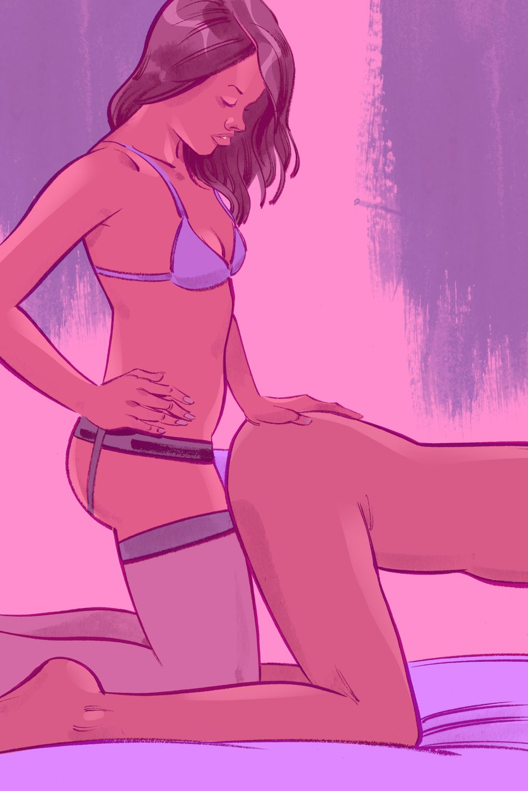
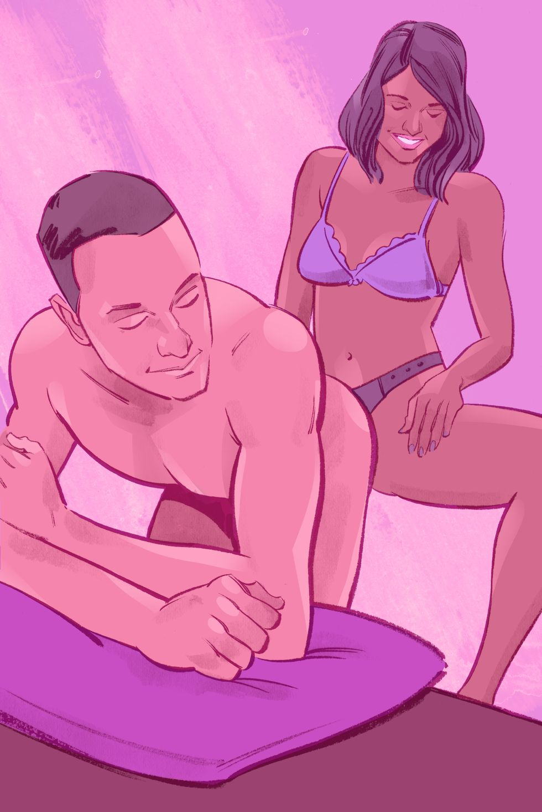
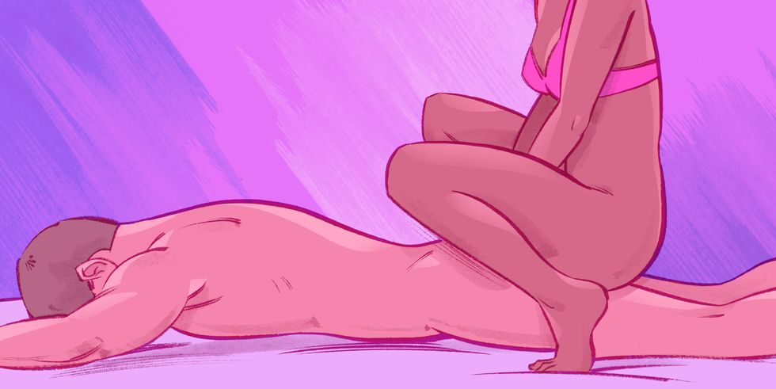
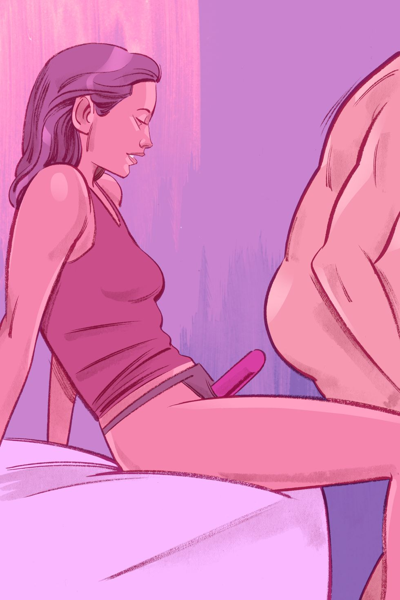
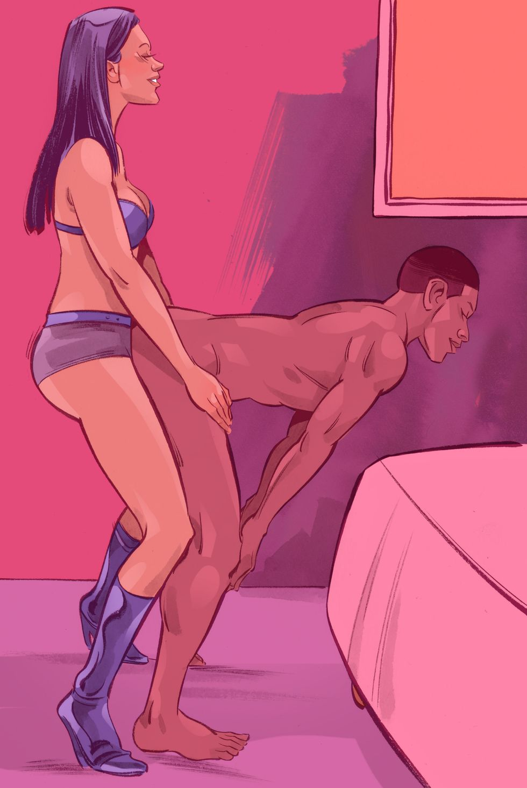
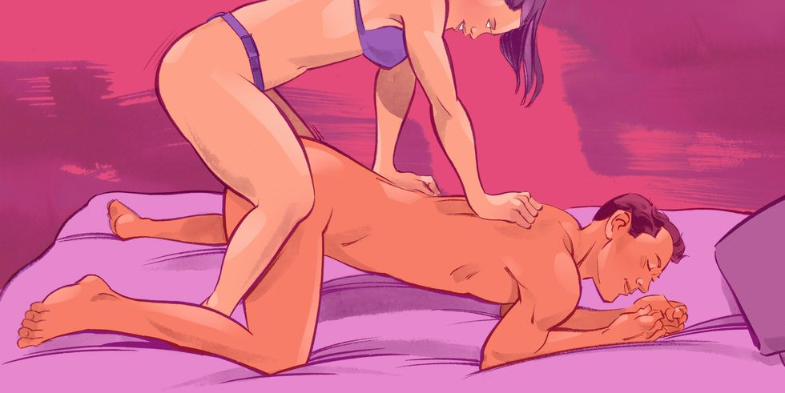
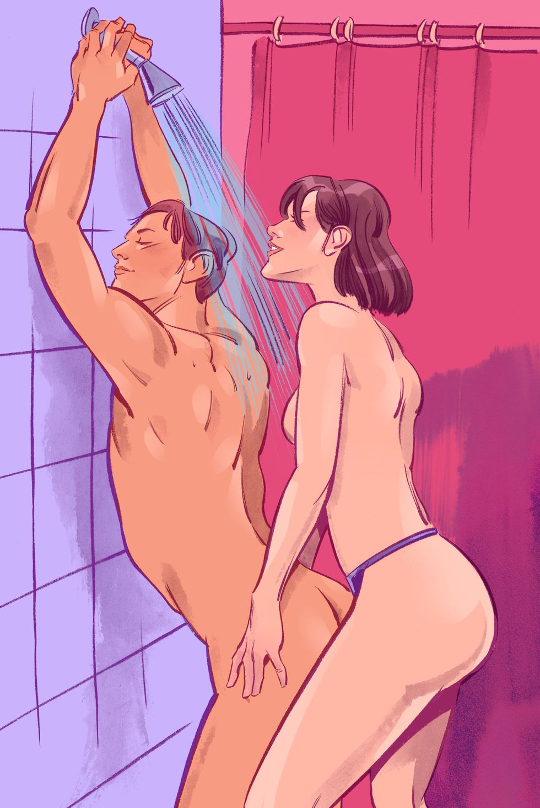
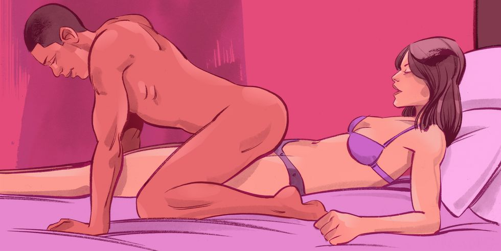

# 10 Perfect Sex Positions for Pegging Your Man

A refresher: Pegging is when you wear a strap-on dildo and penetrate your guy (or girl! Pegging also works with a girlfriend — via either lower hole. Just don't mix and match between holes. Instate a firm "one toy, one hole" policy.). Most of us finally get that a guy being into pegging does not = gay. (I know. So stupid.) It's just a great way to muck about with gender roles, power play, and the pleasures of prostate stimulation for him. Always make sure he enthusiastically wants to try pegging first, and then if he's still a little nervous about being Dominated by The Tool of Male Oppression or whatever, start with a dildo that's specifically designed to look non-penis-like and has a nice little curve for perfect P-spot stimulation (like the Right Spot.)
Also — v. important! — make sure you get equipment that's going do something for you too. Try a harness with a spot to hold a bullet vibe against your clit (like a Corsette.) You can also try a double dildo, but they require a highly Kegel-toned Super Vagina to hold them in, and if you're wet at all (which is kind of the point) you need to hold it with your hand anyway. Whatever you want, sister. You're the one wearing the big ol' fake penis. You get your way today.
Here's your mantra for the five perfect pegging positions below: Be gentle, but act like you mean it. Oh, and use lots of lube.

## Bend Over Boyfriend

Have him get into a modified doggy with his face and arms down on the 
bed. He is very vulnerable and exposed in a way guys aren't usually, so 
be gentle with the poor guy. Talk to him, telling you what you're doing 
and always keeping a reassuring hand on him. Go slowly, letting him 
guide how deeply you go. He will relax into it but it will take some 
time. This is your chance to show someone else everything you've ever 
liked about being penetrated, so think about what you've loved and do 
that. 

## Strap-On Stroke

Sometimes men go soft when they're penetrated — not because they are not enjoying the hell out of it but because, biology. Others get super hard. Flip him over on his back to see how you're affecting him. Either you or he can stroke him along to your thrusts. This (like a lot of pegging positions) won't do a lot for you physically, but (also like a lot of pegging) may be a huge psychological turn-on. Take advantage of it by finding a vibe you can use, during, so you can both completely lose it together. 

## P-Spot Peg

If you're feeling extra bossy, pop some comfy pillows on a desk or table, bend him over it and tell him to hold on tight. You might need to bind his wrist to make your point. You'll be entering him standing from behind, hiking a leg up on the table for leverage and also just to feel like a bad-ass. But before you go all in, toy with him a little first. Touch him, kiss him, play with him, then leave the room for a moment and let him wonder. Don't let him have you until he's begging. 

## The Primal Plunge

For a very primal vibe, have him lie flat on his belly, with his arms over his head. Squat over him and go to town. You'll be on tiptoe, bracing your hands on the ground or his back. Give him a little swat every once in awhile to remind him exactly what's going down. A rare man can come with anal stimulation alone, but most men won't, so when he's ready finish him off by turning him over. And, yes, he is so in charge of finishing you next time. 

## Backdoorman

Sit on the edge of the bed, legs spread wide, and lube up your silicone boner, letting him watch. Have him back up until he's sitting on your lap. He can control how deep he goes here and you can also blow his mind with a reach-around. If you sit on a nice buzzy vibe at the same time, you will both be moaning in about two seconds. 

## Bend Him Like Beckham

This a good beginner position because you have pretty easy access to ... where you need to be. If you're shorter than him, put on some sexy heels, have him bend at the waist and slowly penetrate him from behind. He can steady himself by putting his hands on his thighs, but if the combination of first-time jitters and the whole must-engage-thighs-of-steel aspect is too much for him, he can also brace himself on the edge of the bed. He'll perk up even further when you do a reach-around and start stroking his penis.

## The Chairman of the Board

Sit in a low chair and have him straddle you, slowly letting the dildo enter his butt as he sits down. If he's hesitant about letting you completely take charge, this is another good position to try because he can control how much he's willing to take on, backdoor-wise. It's also super conducive to gazing into each other's eyes and sharing deep kisses. Plus, you're in the perfect spot to stroke his penis and watch as he realizes that he's found the best seat in the house.

## Reverse Doggy Style

If you're turned on by power play, Reverse Doggy is the way to go. He's bent over — ass-up on the bed — in a submissive position, and it's easy to give him a firm spanking if he's been a bad boy. Go ahead and commit to it, reveling in your badassery and he will be quite eager to please you, dear Mistress.

## The Steamy Strap-On

The shower offers general sexy, soapy slipperiness, plus the advantage of easy clean-up afterward. The keys to a successful wet peg are making sure everyone is holding onto something sturdy, remembering that water is not lube (You still need to use lube!!!), and being 8 billion percent certain that all your equipment is safe for water use. Electrocution via lady-boner is a real buzzkill.

## Reversed cowboy

Lie on your back and have him straddle your hips, facing away from you. In this position — kind of a reverse reverse cowgirl — he gets to control how fast and deep he takes your silicone luv. He'll also have a free hand or two to stroke himself as he rides you. Pop in a nice little vibrator for you, lay back, and enjoy the view of his (happy) ass. 

## Additional

Greetings Peggers! It’s time for the real fun. Let us go through each of the pegging positions and see what makes each one fun to try!

 

### Doggy Style

Great for beginners, this common pegging position is beneficial because it allows you to see the exact positioning of the dildo and gives you easy access to exactly where you need to go! Add some pillows under your knees if you need some leverage and communicate to know the exact pace your partner is comfortable with.

 

### Standing Doggy

A variation on the classic doggy style, this peggng position has your man standing and bent over while you penetrate him from behind. Don’t worry about any height difference that may stand in your way – bring out your high heels and go to town. He can brace himself on the bed or another piece of furniture, and you can always do the “reach around” to stroke his cock for extra pleasure.

 

### Missionary

For the romantics out there, this classic pegging position is for you!  Although this works best if the man is slightly flexible, this position is great because it allows for eye contact between the two of you, amplifying the intimacy of your experience. If you’re struggling with insertion, try bringing him to the edge of bed while you stand.

 

### Reverse Cowboy

Another great pegging position for beginners, this requires you to lie on your back while he straddles you, facing away. From this, he is able to control the depth and speed of the dildo, which is why it’s perfect for someone who may still be getting used to pegging play.

 

### Shower Strap-On

For those who feel comfortable with a strap-on, take your experience into the shower for some extra steamy fun. Enjoy the slippery sensations he leans against the shower wall, arching his back to allow access for you to penetrate him. While this pegging position can be tricky if there is a great height difference, it can be an incredible sensation once the correct angle is found. Just make sure you are both holding onto something sturdy and remember that water is not lube!

 

### The Primal Plunge

Tune into your primal instincts – have him lie flat on his stomach, while you squat over him, on your tiptoes, bracing on his back. This is a super hot position, but does make his penis inaccessible, so this is a good position to start with before switching to another move.

 

### Sit and Peg

Another great position for those just starting off, the “sit and peg” requires that you sit in a chair while your man straddles you, lowering himself onto the dildo. Not only is he in control of the depth and pace of the action, but you guys get to make eye contact as well – win win!

 

### Spooning

Whether you’re a beginner in the world of pegging or are just in a more relaxing mood, spooning is a great strap-on position because it helps regulate depth control while also allowing for a lot of skin-to-skin contact. Lazy Sunday morning, anyone?

## The Post Peg Cuddles

This is one of my favorite parts! After pegging, he very clearly feels vulnerable, emotionally drained, unsure of himself. Seeing him get sweet and needy and slutty. The feelings go right to my crotch and my heart. Watching him gasp for breath as you enter him and feel so full is like nothing else. You will find him naturally wanting to touch your body and cuddle with you. Prepare for the fact that he will be more verbal about his feelings since pegging is such an emotionally overwhelming experience. Guys aren’t used to being dominated and he will be expressive about his feelings and emotions that range from shame to excitement. Comfort him and enjoy watching him ride his rollercoaster of emotions. The dopey expression of tender submission on his face will say it all.

This is the best time to get him to talk about what he liked and what he didn’t like about the experience. Ask him directed questions about his favorite and least favorite parts. Ask him how it made him feel to allow you inside of him. Use your words to remind him that you did in fact dominate him sexually but allow him to appreciate and accept that reality together, with you.

Snuggle with him and indulge his feelings. Give him compliments and tell him that he did a good job. Give him some specifics that you particularly enjoyed. You will see a very clear reaction to your reassurance, it is almost cute. The more that you give in to this side of his vulnerability, the more intimate your pegging sessions can become. Let him know how much you enjoy these sessions since it can seem one-sided from the male perspective. We enjoy it for much of the same reasons that he does, it is an intensely emotional experience to take him in this way. He will be physically and emotionally exhausted to the point that he can barely move his legs and is just drained from all of the excitement.

It’s also a perfect bonding opportunity, because he has to open himself up and allow himself to become vulnerable just as I have to. It gives him a better understanding of sex, and we really bond over the shared experience of vulnerability and newness.

You’ve made a huge step by trying pegging together and he has too by allowing himself to be vulnerable for you! In our culture, guys are taught that vulnerability makes them weak but the feelings that you share together will give you a strength like no other. We’ve come to accept penetration and dominance as part of sex but for men, it can be quite a mind blowing experience

## Should He Cum?

If you let him cum, be prepared to put an immediate end to your cuddles. If you forbid an orgasm for a day or two, you will get a more emotional and nurturing man. Separating pegging from orgasm helps him enjoy the act of pegging rather than focusing on the expected release after your session.

If you let him cum, he will be back to his normal self nearly immediately. Give it a try both ways and see what works for your relationship. The orgasm should always be his reward, never a guarantee so I would recommend that you treat it like dessert. You don’t have dessert after every meal but that doesn’t mean that each meal wasn’t good. Denying the orgasm helps give him a greater enjoyment for everything else.

If he hasn’t experienced an orgasm in some time, his prostate is much more swollen and sensitive. After a session or two where he wasn’t permitted a release, his moans are noticeably different and he moves more. Slutty is the best word to describe it, grinding himself on me and doing more of the work. Not just

## How Frequently Do You Peg?

I get this question quite a bit. For the last year, pegging has also been on the uptick for us. If I was to look at the last couple months, we peg twice as often as we have PIV sex. This has increased and decreased over time but we really enjoy it. The feelings of closeness that it allows us to experience together are unlike anything that we can get from PIV sex. If we are being real, the truth is that I desire it more so we do it more.

## Other Comments

Remember if you have him suck on the toy that it should be cleaned thoroughly with antibacterial soap prior to it being in his mouth. It is an intensely pleasurable experience to look down at him and see your toy in his mouth. Just take the right precautions to ensure that nobody gets sick.

Never use the same toy for vaginal play. Keep the brown toys and the pink toys separate. The vagina is very sensitive to infection so we have two separate toy boxes just to prevent any possible confusion.

An light anal cleaning is recommended to ensure that you don’t have any surprises during your play. Remember that he is only cleaning the last little bit of his bum and not his whole intestinal tract so this isn’t some crazy ordeal. Just a quick cleaning in the shower. This is optional if he feels clean or if you are ok with a possible slight mess.